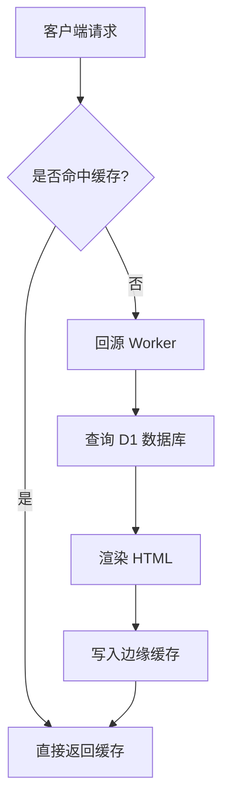
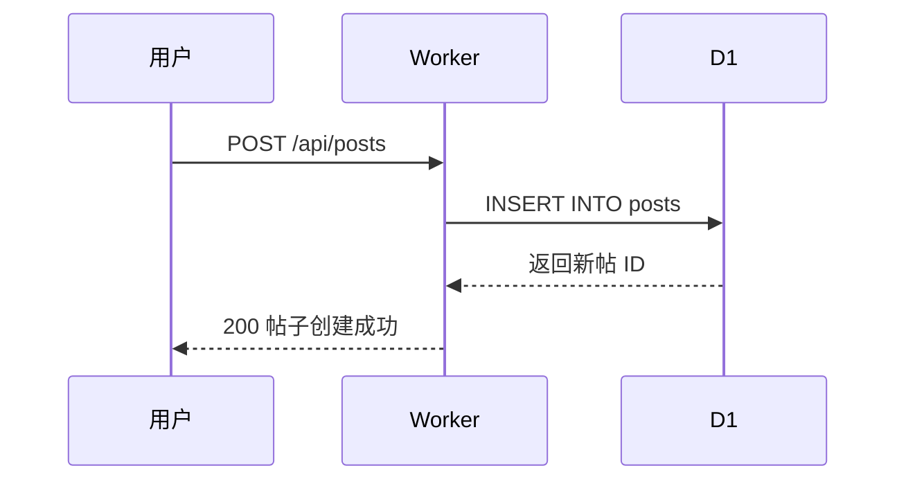
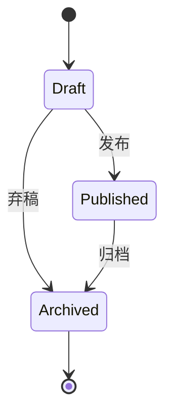

> [!TIP] 这是一篇示例文章
> 本文覆盖所有 Markdown 格式，用于检查渲染效果。如有显示问题，请反馈修改。

## 标题层级

# 一级标题 H1

## 二级标题 H2

### 三级标题 H3

#### 四级标题 H4

## 文本样式

普通段落文字。**加粗文字**、*斜体文字*、~~删除线文字~~、`行内代码`、<u>下划线</u>。

上标示例：E=mc<sup>2</sup>，下标示例：H<sub>2</sub>O。

> [!NOTE] 引用与提示
> 这是**普通引用块**（blockquote）：
> 多行引用内容，第二行。
> 
> 引用内可以包含其他格式：**加粗**、`代码`、[链接](https://example.com)。

## 列表

### 无序列表

- 苹果
- 香蕉
- 水果的子项
  - 子项 A
  - 子项 B
- 葡萄

### 有序列表

1. 第一步：安装依赖
2. 第二步：配置环境
3. 第三步：启动服务
   1. 嵌套有序 a
   2. 嵌套有序 b
4. 第四步：完成

### 任务列表

- [x] 已完成的项
- [ ] 未完成的项
- [x] 又一个完成项

## 链接

[行内链接](https://example.com) 和 [带标题的链接](https://example.com "标题")。

自动链接：https://example.com

## 代码块

### Bash

```bash
#!/bin/bash
# 遍历目录并统计行数
for file in $(find src -name "*.ts"); do
  lines=$(wc -l < "$file")
  echo "$file: $lines 行"
done

# 启动开发服务器
pnpm dev --port 5173
```

### JavaScript

```js
// 异步请求封装
async function fetchJson(url, options = {}) {
  const res = await fetch(url, {
    headers: { "Content-Type": "application/json" },
    ...options,
  });
  if (!res.ok) throw new Error(`HTTP ${res.status}`);
  return res.json();
}

const data = await fetchJson("/api/config");
console.log(data.turnstileEnabled); // false
```

### TypeScript

```ts
interface Post {
  id: number;
  title: string;
  content: string;
  createdAt: string;
}

type PostStatus = "draft" | "published" | "archived";

const getPost = async (id: number): Promise<Post | null> => {
  const posts: Post[] = await db.query("SELECT * FROM posts WHERE id = ?", [id]);
  return posts[0] ?? null;
};
```

### Python

```python
from typing import Optional
import requests

def get_avatar(username: str) -> Optional[str]:
    """获取用户头像 URL"""
    url = f"https://api.github.com/users/{username}"
    resp = requests.get(url, timeout=10)
    if resp.status_code != 200:
        return None
    return resp.json().get("avatar_url")
```

### JSON

```json
{
  "name": "peroe",
  "version": "1.0.0",
  "features": ["blog", "forum", "tools"],
  "deploy": {
    "platform": "cloudflare",
    "region": "auto"
  }
}
```

### YAML

```yaml
# wrangler 配置示例
name: peroe-main
compatibility_date: "2026-08-02"
d1_databases:
  - binding: DB
    database_name: forum_db
observability:
  enabled: true
```

### SQL

```sql
-- 查询热门帖子
SELECT p.id, p.title, u.username, COUNT(c.id) AS comment_count
FROM posts p
JOIN users u ON u.id = p.author_id
LEFT JOIN comments c ON c.post_id = p.id
WHERE p.created_at > datetime('now', '-7 days')
GROUP BY p.id
ORDER BY comment_count DESC
LIMIT 10;
```

### HTML

```html
<!DOCTYPE html>
<html lang="zh-CN">
  <head>
    <meta charset="UTF-8" />
    <title>示例页面</title>
  </head>
  <body>
    <main class="container">
      <h1>Hello, World!</h1>
    </main>
  </body>
</html>
```

### CSS

```css
.container {
  max-width: 960px;
  margin: 0 auto;
  padding: 1rem;
  background: #1e1e2e;
}

.card:hover {
  transform: translateY(-2px);
  transition: transform 0.2s ease;
}
```

### Go

```go
package main

import (
	"fmt"
	"time"
)

func main() {
	now := time.Now()
	fmt.Printf("当前时间: %s\n", now.Format("2006-01-02 15:04:05"))

	nums := []int{1, 2, 3, 4, 5}
	sum := 0
	for _, n := range nums {
		sum += n
	}
	fmt.Println("总和:", sum)
}
```

### PowerShell

```powershell
# 批量重命名文件
$files = Get-ChildItem -Path . -Filter "*.log"
foreach ($file in $files) {
    $newName = $file.BaseName + "_archived" + $file.Extension
    Rename-Item -Path $file.FullName -NewName $newName
    Write-Host "已重命名: $($file.Name) -> $newName"
}
```

### 无语言代码块

```
这是没有声明语言的代码块
第二行内容
```

## 表格

### 简单表格

| 语言 | 用途 | 高亮 |
|------|------|------|
| TypeScript | 大前端 | ✅ |
| Hono | 后端 API | ✅ |
| SQL | 数据库 | ✅ |

### 对齐表格

| 左对齐 | 居中 | 右对齐 |
|:-------|:----:|-------:|
| 文本 | 居中文本 | 123 |
| 更长的文本 | 更长 | 4567 |

## Callout 提示框

> [!NOTE]
> 说明提示框用于补充背景、解释名词或提供上下文。

> [!CAUTION]
> 小心提示框用于提醒潜在风险或需要特别注意的操作。

## Mermaid 流程图

### 流程图



### 时序图



### 状态图



## 转义字符

以下特殊字符原样显示：\*星号\*、\_下划线\_、\#井号\#、\`反引号\`、\[方括号\]。

## 分隔线

---

## 脚注示例

这里是脚注引用[^1]，这里也是[^2]。

[^1]: 脚注 1 的内容说明。
[^2]: 脚注 2 的内容说明。

## 综合示例

> [!WARNING] 部署前检查清单
> 1. 确认 `CLOUDFLARE_API_TOKEN` 环境变量已设置
> 2. 运行 `pnpm run typecheck` 通过
> 3. 运行 `pnpm build` 构建成功
> 4. 执行 `wrangler deploy` 部署
>
> ```bash
> pnpm run typecheck && pnpm build
> wrangler deploy
> ```
